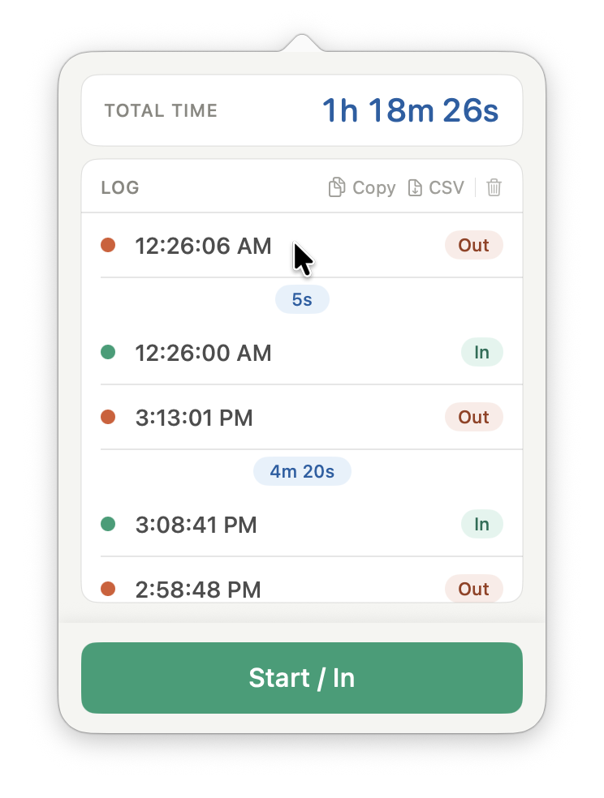

# Depo Timer

A simple "on the record / off the record" timer for legal depositions. Tap **Start / In** when you go on the record, **Stop / Out** when you go off. The app keeps a running total of recorded time across all sessions, lets you edit timestamps after the fact, and exports the log as plain text or CSV.

Available three ways:
- **macOS menu bar app** — lives in your menu bar, no dock icon
- **iOS app** — with a Live Activity, Lock Screen widget, and Control Center toggle
- **Web app** — a single static HTML page (`index.html`) that uses `localStorage`

All three share the same UI conventions, the same export formats, and (for the macOS + iOS apps) the same log via App Groups + iCloud Key-Value Store, so a session you start on one device shows up on the other.

## Screenshot

<p align="center">
  
</p>

## Why

During depositions, attorneys often need to know exactly how long the witness has been on the record — both for billing and for procedural limits (e.g., the 7-hour federal cap under FRCP 30(d)(1)). Stopping/starting a stopwatch by hand and adding up segments is error-prone. This app does the math.

## What you get

- A log of every in/out punch with the exact timestamp
- The **duration of each on-record stretch** displayed between paired punches
- A live **total time** that ticks while you're on the record
- **Inline editing** of any timestamp — useful when someone forgets to hit the button
- **Copy to clipboard** (plain text) or **CSV export** for billing systems
- A confirmation prompt if you try to export while the timer is still running

## Project layout

```
.
├── Packages/DepoKit/             Local Swift Package — shared code
│   └── Sources/
│       ├── DepoCore/             Foundation-only model, storage, math, exports
│       ├── DepoLiveActivity/     iOS Live Activity attributes + intents
│       └── DepoUI/               Cross-platform TimerView + TimerModel
├── MenuBarTimer/                 macOS menu bar app target
├── DepoTimer/                    iOS app target
├── DepoTimerWidget/              iOS widget extension (Live Activity + Control Center)
├── MenuBarTimer.xcodeproj
├── index.html                    Web version (self-contained)
├── help.html                     Help page for the web version
└── favicon.svg
```

Data flows through `DepoStorage` (in `DepoCore`), which writes to an App Group `UserDefaults` suite and mirrors the same data to iCloud KVS for cross-device sync.

## Requirements

- **macOS app**: macOS 13+
- **iOS app + widget**: iOS 18+ (the Control Center widget uses iOS 18 APIs)
- **Xcode**: 16+ (Swift 6.0 / PackageDescription 6.0)
- **Web app**: any modern browser; no build step

## Opening in Xcode

1. Open `MenuBarTimer.xcodeproj`.
2. Select your team under each target's **Signing & Capabilities** tab.
3. The App Group `group.net.eurekastreet.DepoTimer` must be registered on developer.apple.com and attached to each App ID. (Or rename it everywhere to your own group ID — the string lives in each `.entitlements` file and in `Packages/DepoKit/Sources/DepoCore/DepoStorage.swift`.)
4. Pick the **MenuBarTimer** or **DepoTimer** scheme and ⌘R.

## Web version

Open `index.html` directly in a browser. No server needed — data persists in `localStorage`. Desktop browsers get a `Space` keyboard shortcut to start/stop.
